<h1 align="left">🖐️ 你好哦~</h1>

    

    <a href="https://blog.x-lf.com">我的博客</a>
    |
    <a href="https://git-fy.cn/XiaoLFeng">组织仓库</a>
    |
    <a href="https://space.bilibili.com/244321572">哔哩哔哩</a>
    |
    <a href="https://t.me/xf_talk">纸飞机群</a>
    |
    <a href="https://qm.qq.com/cgi-bin/qm/qr?k=viCI56D_CRmtKMQZVzKCm9Rhy_0KUwVQ&jump_from=webapi">扣扣群聊</a>

<h2 align="left">关于我</h2>

<blockquote>
    你好哦，我是XiaoLFeng（你可以叫我“筱锋”），目前是一名学生，正在积极学习并迈向软件工程师的目标。我对软件工程充满热情，专注于前端开发、后端开发、全栈开发以及项目设计等方向。平时喜欢探索新技术，解决复杂问题。
</blockquote>

    
    

<h3 align="left">技术栈</h3>

 

<h3 align="left">自述</h3>

    <ul>
        <li>🎮 我热衷于玩策略和管理类游戏，比如《迷你空管》、《迷你高速公路》和《铁路调度模拟器》等游戏（但不是游戏爱好者）。</li>
        <li>🎵 开发时我喜欢听轻音乐，平时也会听 ACG 音乐。我是个普通的二次元，比较喜欢东方Project，博麗霊夢は大すきだ!!!</li>
        <li>👨‍💻 目前工作在（不好意思，还在上学）。</li>
        <li>📚 业余时间喜欢阅读技术博客，增强自己的技术栈。</li>
        <li>🌱 目前正在学习 Golang(Gin)。</li>
        <li>🅱️ 这是我的博客 <a href="https://blog.x-lf.com/">凌中的锋雨</a> ，欢迎交换友链哦~</li>
        <li>🏢 大三在校生，努力学知识，也希望能够在未来找到一份好工作。（差不多要去实习了）</li>
    </ul>

<h2 align="left">联系方式</h2>

    <ul>
        <li>✉️ Email：<a href="mailto:gm@x-lf.cn">gm@x-lf.cn</a></li>
        <li>✈ Twitter：<a href="https://twitter.com/lfeng_xiao">筱锋xiao_lfeng</a></li>
        <li>🐧 QQ: 1144939537</li>
    </ul>

<h2 align="center">我的进度</h2>

    
    

欢迎浏览我的GitHub，🍀如果您对我的代码有兴趣，可以跟我一起进行开发喔！

